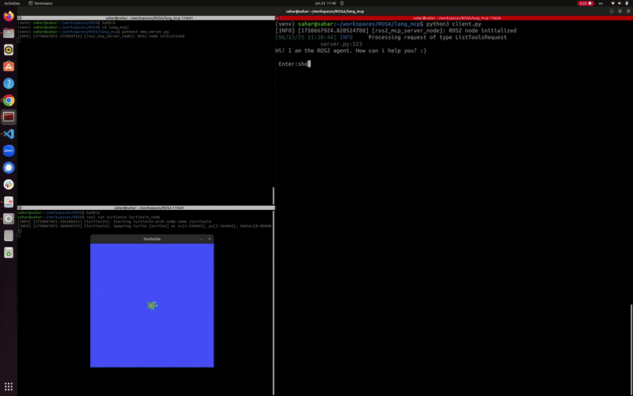

# MCP + LangGraph Integration for ROS 2 Robot Agent

This project integrates the Model Context Protocol (MCP) tool with [LangGraph](https://github.com/langchain-ai/langgraph) to build an LLM-powered ROS 2 robot agent.

This project utilizes few tools defined in the [ROSA](https://github.com/nasa-jpl/rosa) repository, as MCP tools.

## Features

- Python-based client-server architecture
- Uses MCP to connect local language models
- Integrates with ROS 2 (Humble)
- Designed for robotic decision-making workflows

## Files

- `client.py`: Connects to MCP-enabled server and handles language model interaction, it has beed tested with the LLM model **LLaMA 3.1:70B**.
- `new_server.py`: Handles server-side logic and MCP node management

## Requirements

- Python 3.10+
- ROS 2 Humble

```bash
pip install fastmcp
pip install langchain-mcp-adapters
```
## Usage

Make sure you have ROS 2 Humble installed. You can follow the official guide here: [ROS 2 Installation Instructions](https://docs.ros.org/en/humble/Installation.html)


### 🐢 Install and Run Turtlesim

```bash
sudo apt update
sudo apt install ros-humble-turtlesim
```

Run turtlesim in a terminal:

```bash
ros2 run turtlesim turtlesim_node
```

---


### 🤖 Run ROS Agent (Client)

Clone this repo:

```bash
git clone git@github.com:sahars93/Langgraph-mcp-ROS2.git
```

In another terminal, run:

```bash
python3 client.py
```


## Demo


